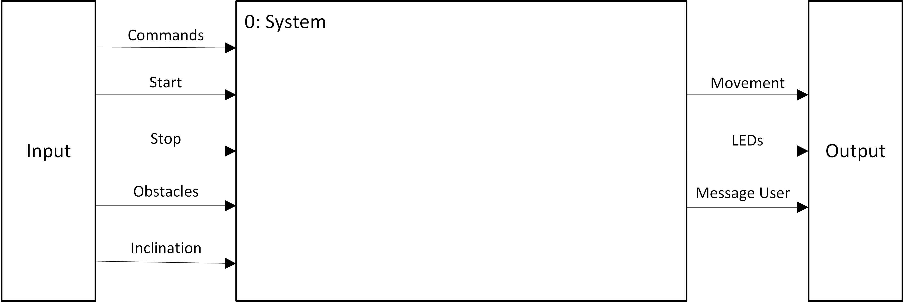
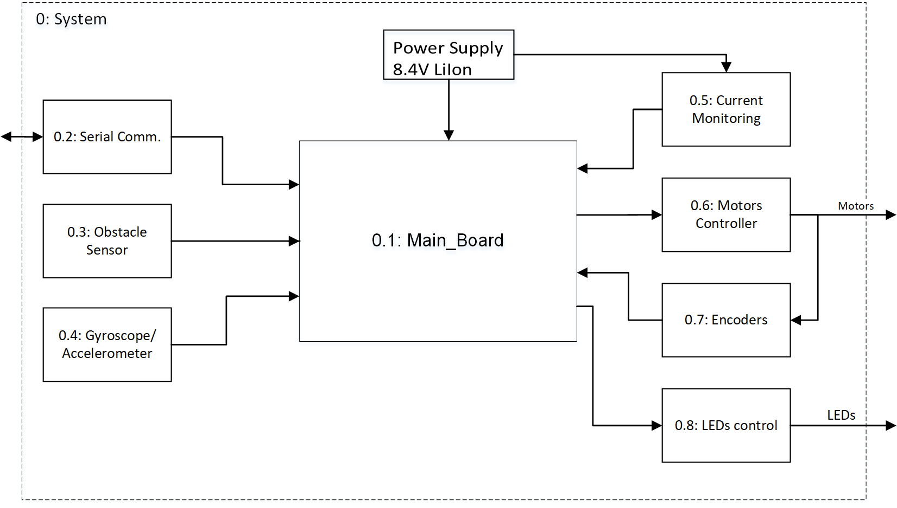
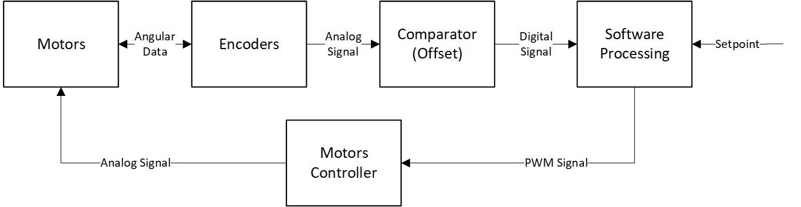
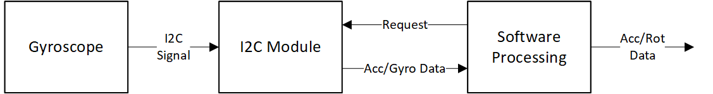

\maketitle

# Introdução
Este documento pretende descrever de forma sucinta, mas completa, um projeto laboratorial para a unidade curricular de Eletrónica IV. Neste documento será descrita a proposta do projeto, incluindo o seu objetivo, funcionalidades previstas e uma breve descrição da sua implementação. Será ainda indicada uma lista dos materiais necessários e discutido o enquadramento do projeto com os conteúdos programáticos de Eletrónica IV.

# Descrição sumária do projeto
O projeto a desenvolver consiste num robô com tração às 2 rodas e com um _ball caster_[^1] como terceiro ponto de apoio. Este robô terá como principal objetivo a capacidade de se deslocar em 2 dimensões num ambiente controlado, sem embater em nenhum obstáculo.

## Funcionalidades
O robô deverá possuir as seguintes funcionalidades:

- Deslocar-se segundo um dos seus eixos coordenados;
- Rodar em torno do seu centro geométrico[^2];
- Detetar obstáculos;
- Monitorizar e atuar caso os motores entrem em _stall_;
- Comunicação com o computador, usando uma interface por linha série.

# Implementação

## Estrutura Mecânica
A estrutura mecânica, a ser construída, terá a forma circular e permitirá suportar toda a estrutura de locomoção, as baterias, os vários sensores e o sistema do robô (microcontrolador + circuitos eletrônicos envolventes).

Na figura \ref{up_view} é apresentado um esboço da estrutura mecânica do robô, sendo também identificadas as várias zonas funcionais do mesmo (rodas, sistema, sensores e baterias), bem como o seu posicionamento relativo[^3].

Como mostra a figura, na lateral do robô serão colocadas as duas rodas e na sua traseira um _ball caster_. As duas rodas serão movimentadas usando motores DC com _encoders_. Estes motores serão responsáveis pela locomoção enquanto o ball caster servirá como ponto extra de apoio.

A estrutura terá no máximo as dimensões de $30 cm \times 30 cm \times 30 cm$

\begin{figure}[H]
\centering
\includegraphics[width=0.5\textwidth]{images/robot_up_view.png}
\caption{Divisão estrutural dos vários componentes do robô, vista de cima.}
\label{up_view}
\end{figure}

Na figura \ref{up_view}, os números representam as seguintes entidades funcionais.

1. Espaço dedicado à implementação do sistema (microcontrolador +  circuitos eletrónicos envolventes);
2. Botões de _start_ e _stop_, usados para controlar o funcionamento do robô;
3. Bateria;
4. O _ball caster_;
5. Rodas e o seu sistema de fixação ;
6. Os 5 sensores de obstáculos que usam tecnologia _time of flight_.

## Visão global do funcionamento do sistema
O diagrama de instrumentação de nível 0 é apresentado na imagem \ref{diagram0}.

O funcionamento do robô pode ser descrito, de forma sucinta, da seguinte forma: primeiro, o robô recebe comandos do utilizador, tais como, distância a percorrer, velocidade, direção e sentido do movimento, e posteriorment à sua interpretação, irá atuar nos motores para realizar a ação especificada.

Além disso, ao longo de todo o processo, irá proporcionar _feedback_ do estado da sua operação de forma luminosa (LEDs) e por mensagem para o utilizador, usando a interface pc-microcontrolador.

## Instrumentação
O diagrama de blocos de nível 1 pode ser consultado na imagem \ref{diagram1}.

Os sensores de obstáculos serão . Estes sensores serão colocados estrategicamente na superfície lateral do robô para detetar obstáculos e permitir a navegação num ambiente 2D controlado e adequado às dimensões físicas do robô.

Será ainda utilizado, apesar de não representado no esboço (figura \ref{up_view}), um giroscópio/acelerômetro. Este será integrado num módulo capaz de indicar a posição e orientação do robô relativamente à sua posição inicial, sendo também utilizado para auxiliar a locomoção do mesmo.

## Controlo
O controlo do motores será realizado partindo da conjugação dos dados dos encoders com os dados do giroscópio/acelerômetro.

Os dados dos encoders serão realimentados a um algoritmo de controlo, como mostra a cadeia de instrumentação da figura \ref{motors}, que fará os ajustes necessários de forma a que os motores rodem às velocidades especificadas inicialmente.

A utilização do giroscópio/acelerômetro, a partir da cadeia de instrumentação da figura \ref{gyro}, permitirá uma localização mais precisa e possivelmente corrigir erros derivados da estrutura mecânica (rotação sobre o centro geométrico, drift devido a desalinhamento das rodas) que a utlização apenas de encoders não permitiria resolver. Estes dados serão também fornecidos ao algoritmo de controlo que fará os motores rodar.

# Material Necessário
  - PIC32MX
  - Motores
  - Bola de Apoio
  - Rodas
  - H-bridge
  - Encoders
  - MPU6050
  - VL53L0X TOF Distance sensor
  - 2 Li-Ion cell - 16850
  - Suporte bateria
  - Regulador de Tensão
  - Adaptador USB-Serial
  - LEDs smd
  - Botões
  - Resistências e outros componentes

# Enquadramento com os objetivos de E4

[^1]: Um _ball caster_ é uma estrutura de apoio constituída por uma bola esférica de baixo atrito que serve de ponto de apoio e permite a locomoção do robô em qualquer direção

[^2]: A rotação segundo o centro geométrico do robô poderá não ser exata, devendo ser considerada uma rotação aproximada em torno do seu centro geométrico.

[^3]: Esta imagem deve ser analisada considerando que representa apenas um esboço da estrutura do robô, com o intuito de facilitar a visualização dos assuntos descritos no texto. A imagem não deve ser entendida como uma versão preliminar da estrutura, mas apenas como uma "ideia" do que poderá virá a ser.
