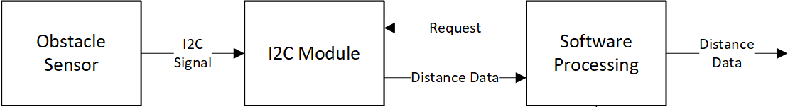
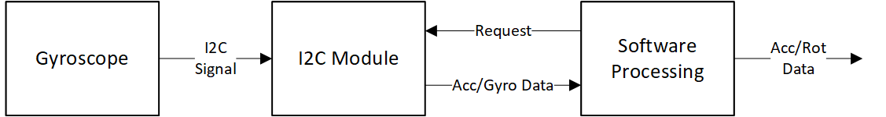
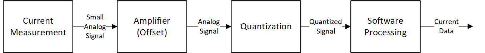

\maketitle

# Introdução
Este documento pretende descrever de forma sucinta, mas completa, uma proposta de um projeto para a unidade curricular de Eletrónica IV. Neste documento será descrita a proposta do projeto, incluindo o seu objetivo, funcionalidades previstas e uma breve descrição da sua implementação. Será ainda indicada uma lista dos materiais necessários e discutido o enquadramento do projeto com os conteúdos programáticos de Eletrónica IV.

# Descrição sumária do projeto
O projeto a desenvolver consiste num robô com tração às 2 rodas e com um _ball caster_[^1] como terceiro ponto de apoio. Este robô terá como principal objetivo a capacidade de se deslocar em 2 dimensões num ambiente controlado, sem embater em nenhum obstáculo.

## Funcionalidades
O robô deverá possuir as seguintes funcionalidades:

- Deslocar-se segundo um dos seus eixos coordenados;
- Rodar em torno do seu centro geométrico[^2];
- Detetar e evitar obstáculos;
- Monitorizar e atuar caso os motores entrem em _stall_;
- Comunicação com o computador, usando uma interface por linha série.

# Implementação

## Estrutura Mecânica
A estrutura mecânica, a ser construída, terá a forma circular e permitirá suportar toda a estrutura de locomoção, as baterias, os vários sensores e o sistema do robô (microcontrolador + circuitos eletrônicos envolventes).

Na figura \ref{up_view} é apresentado um esboço da estrutura mecânica do robô, sendo também identificadas as várias zonas funcionais do mesmo (rodas, sistema, sensores e baterias), bem como o seu posicionamento relativo[^3].

Como mostra a figura, na lateral do robô serão colocadas as duas rodas e na sua traseira um _ball caster_. As duas rodas serão movimentadas usando motores DC com _encoders_. Estes motores serão responsáveis pela locomoção, enquanto o ball caster servirá como ponto extra de apoio.

A estrutura terá no máximo as dimensões de $30 cm \times 30 cm \times 30 cm$

\begin{figure}[H]
\centering
\includegraphics[width=0.5\textwidth]{images/robot_up_view.png}
\caption{Divisão estrutural dos vários componentes do robô, vista de cima.}
\label{up_view}
\end{figure}

Na figura \ref{up_view}, os números representam as seguintes entidades funcionais.

1. Espaço dedicado à implementação do sistema (microcontrolador +  circuitos eletrônicos envolventes);
2. Botões de _start_ e _stop_, usados para controlar o funcionamento do robô;
3. Bateria;
4. O _ball caster_;
5. Rodas e o seu sistema de fixação ;
6. Os 5 sensores de obstáculos que usam tecnologia _time of flight_.

## Visão global do funcionamento do sistema
O diagrama de instrumentação de nível 0 é apresentado na imagem \ref{diagram0}.

O funcionamento do robô pode ser descrito, de forma sucinta, da seguinte forma: primeiro, o robô recebe comandos do utilizador, tais como, distância a percorrer, velocidade, direção e sentido do movimento, e posteriormente à sua interpretação, irá atuar nos motores para realizar a ação especificada.

Além disso, ao longo de todo o processo, irá proporcionar _feedback_ do estado da sua operação de forma luminosa (LEDs) e por mensagem para o utilizador, usando a interface pc-microcontrolador.

## Instrumentação
O diagrama de blocos de nível 1 pode ser consultado na imagem \ref{diagram1}. Neste diagrama são identificados os sensores previstos para este projeto e os atuadores. Os sensores a usar são:

- Sensores de Obstáculos
- Giroscópio/Acelerômetro
- Monitorização do consumo de corrente dos motores
- Encoders

e os atuadores serão apenas os motores.

\begin{figure}[H]
\centering
\includegraphics[width=\textwidth]{images/diagram_level_1.png}
\caption{Diagrama de blocos de nível 1}
\label{diagram1}
\end{figure}

### Sensor de obstáculos
Os sensores de obstáculos serão colocados estrategicamente na superfície lateral do robô para permitir uma detecção eficiente de obstáculos e a navegação num ambiente 2D controlado e adequado às dimensões físicas do robô.
A cadeia de instrumentação deste sensor pode ser consultada na figura \ref{cadeia_obs}. Nesta cadeia o sensor de obstáculos comunicará com microcontrolador usando um mecanismo de pedido/envio de dados, através do protocolo I2C, sendo esses dados posteriormente tratados por _software_, de modo a efetuar a transdução para uma distância.

 

### Giroscópio/Acelerômetro
Apesar de não representado no esboço estrutural do robô(figura \ref{up_view}), será utilizado um giroscópio/acelerômetro. Este sensor será integrado num módulo que se pretende que seja capaz de indicar a orientação do robô relativamente à orientação inicial, fornecendo informação que será usada para auxiliar a locomoção do robô.

A cadeia de instrumentação, representada na figura \ref{cadeia_gyro}, evidencia o protocolo de comunicação, I2C, a ser usado com o sensor, sendo os dados posteriormente tratados em _software_. 

 

### Monitorização da corrente nos motores
Este sensor tem como funcionalidade garantir que a corrente nos motores, devido a fenómenos de _stall_, não ultrapassa valores considerados seguros, evitando a possível destruição dos motores. A cadeia de instrumentação é representada na figura \ref{cadeia_curr}. 

O sinal elétrico que contém a informação da corrente é de reduzida excursão (no máximo algumas dezenas de milivolt), sendo necessário acondicionar de forma adequada, como demonstrado na imagem, para puder extrair informação relevante.

## Breve descrição do algoritmo de controlo
O controlo do motores será realizado partindo da conjugação dos dados dos encoders com os dados do giroscópio/acelerômetro.

Os dados dos encoders serão introduzidos no algoritmo de controlo, como mostra a cadeia de instrumentação da figura \ref{cadeia_motors}. Este algoritmo terá a capacidade de controlar a locomoção do robô, fazendo as correções necessárias para que os motores rodem às velocidades especificadas pelo operador.

\begin{figure}[H]
\centering
\includegraphics[width=\textwidth]{images/diagramas_instrumentacao_8.png}
\caption{Cadeia de Instrumentação Motores/Encoders}
\label{cadeia_motors}
\end{figure}

A utilização do giroscópio/acelerômetro permitirá uma localização mais precisa e possivelmente a correção de erros derivados da estrutura mecânica (rotação sobre o centro geométrico, _drift_ devido ao desalinhamento das rodas, etc.) que a utilização de encoders, por si só, não permitiria resolver. Estes dados serão também fornecidos ao algoritmo de controlo, melhorando a resposta do controlador.

# Material necessário
Nesta fase preliminar, prevemos que seja necessário, para além de componentes passivos/ativos presentes no DETI:

- Microcontrolador: PIC32MX
- Motores
- _Ball caster_
- Rodas
- _H-bridges_
- _Encoders_
- Giroscópio/Acelerômetro (p.e., MPU6050)
- Sensor de obstáculos (p.e., VL53L0X TOF Distance sensor)
- Bateria (p.e., Li-Ion cell - 16850)
- Suporte bateria
- Regulador de Tensão
- Adaptador USB-Serial
- LEDs SMD
- Botões

# Enquadramento com os objetivos de E4
Uma vez que o principal foco da unidade curricular de Eletrónica IV é o estudo da metrologia e a transdução de outras grandezas em grandezas elétricas, o trabalho proposto apresenta várias cadeias de instrumentação, permitindo o projeto de circuitos de aquisição e acondicionamento de sinal. No projeto descrito, serão também exploradas as necessidades da conversão de sinal, para se obter grandezas em escalas úteis, como é o caso dos dados do giroscópio/acelerômetro, e serão também aplicados métodos para reduzir o efeito de perturbações no sistema, como, por exemplo, na medição da corrente consumida pelos motores.

Apesar do principal foco do projeto ser o controlo do movimento do robô, de modo a este ser capaz de se deslocar de forma precisa num ambiente controlado, o algoritmo de controlo a desenvolver só poderá ser eficaz se os seus sinais de entrada forem devidamente obtidos, obrigando assim a uma trabalho meticuloso em metrologia.

Pelas razões apresentadas acimas, consideramos que o trabalho proposto neste documento enquadra-se nos objetivos da unidade curricular. 

[^1]: Um _ball caster_ é uma estrutura de apoio constituída por uma bola esférica de baixo atrito que serve de ponto de apoio e permite a locomoção do robô em qualquer direção

[^2]: A rotação segundo o centro geométrico do robô poderá não ser exata, devendo ser considerada uma rotação aproximada em torno do seu centro geométrico.

[^3]: Esta imagem deve ser analisada considerando que representa apenas um esboço da estrutura do robô, com o intuito de facilitar a visualização dos assuntos descritos no texto. A imagem não deve ser entendida como uma versão preliminar da estrutura, mas apenas como uma "ideia" do que poderá virá a ser.

